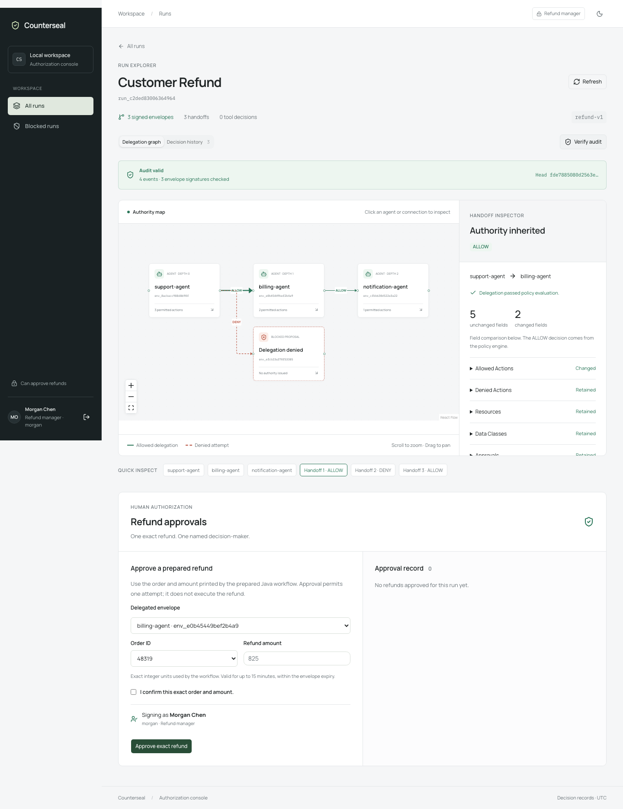

# Counterseal

Signed authority delegation for multi-agent systems. Each handoff can narrow an
agent's permissions; attempts to expand them are rejected and recorded.

[](https://github.com/patelpratyush/Counterseal/actions/workflows/ci.yml)



Explore the [architecture and demo](docs/portfolio.md), watch the
[browser walkthrough](docs/assets/walkthrough.webm), or read the
[API and policy benchmarks](docs/benchmarks.md).

The CLI command is `handoffguard` (see [compatibility identifiers](#compatibility-identifiers)).
See `prd.md` for the full product spec. Implemented slices include the Obligation Envelope
core, the monotonic-delegation policy engine with CEL approval conditions,
a PostgreSQL-backed control API with scoped approvals and audit records,
an MCP tool gateway, a Java/Spring Boot workflow integration, and a Next.js dashboard.
The optional [live-model demo](docs/live-model.md) lets OpenAI propose tool calls
while Counterseal enforces scope and named operator approvals.
[Operational visibility](docs/observability.md) adds correlated Java/gateway/API
spans and authenticated authorization metrics.

## Build

To run the whole stack with Docker:

```bash
./compose.sh up
./compose.sh demo
```

Open http://localhost:3100 and sign in as `operator` with the initial password printed by the launcher.
See [Docker setup](docs/docker.md) for persistence, approval demos, and cleanup.

To build the Go CLI locally:

```bash
go build -o handoffguard ./cmd/cli
```

## Try it

```bash
./handoffguard keygen --out ~/.handoffguard/key
./handoffguard envelope create --in examples/refund-draft.json --key ~/.handoffguard/key.priv --out /tmp/signed.json
./handoffguard envelope verify --in /tmp/signed.json --key ~/.handoffguard/key.pub
```

## Test

```bash
go test ./...
```

## Status

Envelope core, policy engine, server/PostgreSQL, MCP gateway, Java/Spring Boot
orchestration, dashboard, CI workflow, and Docker Compose are implemented.
Hosted CI passes and `main` requires the **CI gate** check through a pull request.
Production deployment hardening remains. See
[policy engine design](docs/design/policy-engine.md) and the
[server guide](docs/server.md) for rules, setup, and limitations.
The stack is integrated into `main`; see the [release checkpoint](docs/release-checkpoint.md)
for verified behavior and remaining work.

## Envelope format and keys

`envelope create` and `envelope verify` accept JSON input. Creation defaults
only `id` and `version`; supply `issuer.agent`, `recipient.agent`, `purpose`,
`policy_version`, and `expires_at` explicitly. The model has no creation timestamp.
Verification requires an expiration strictly later than the verification time.

Key generation refuses to replace either existing key file. Choose a new prefix
for a new keypair. Private keys are base64-encoded raw Ed25519 bytes, stored with
owner-only permissions; base64 is not encryption.

The signing format is Go's compact JSON encoding of the typed envelope, with
map keys sorted and struct fields in declaration order, excluding `signature`.
It is deterministic for this model, but is not RFC 8785 JCS. Signatures use
Ed25519 over the SHA-256 digest of those bytes.

## Check delegated authority

```bash
./handoffguard policy validate examples/policy-parent.json
./handoffguard policy diff examples/policy-parent.json examples/policy-child-allow.json
./handoffguard policy diff examples/policy-parent.json examples/policy-child-deny.json --format json
```

The first diff returns ALLOW. The second returns DENY with `ACTION_EXPANDED`
and `APPROVAL_WEAKENED`, and exits nonzero. Policy commands accept JSON and YAML
envelopes. These examples are unsigned content checks. To verify signatures too:

```bash
./handoffguard policy diff parent-signed.json child-signed.json \
  --parent-key parent.pub --child-key child.pub
```

Children must link to their parent, retain its purpose and policy version, and
identify its recipient as their issuer. Actions, resources, data classes, expiry,
and maximum depth may narrow; denials and approvals must be preserved. Lowering
an approval threshold from `refund.amount > 500` to `refund.amount > 300` is allowed.
Unproven changes to complex conditions are denied; retain the inherited condition
and add another requirement instead.

The Go API `policy.Conditions.RequiredRoles` evaluates CEL conditions for request
data and returns required roles. Any evaluation error must result in denial.
The server verifies stored approvals and consumes them on authorization.
The MCP gateway authorizes tool calls before forwarding them upstream.

```bash
go test -race ./...
go test ./internal/policy -run '^$' -fuzz '^FuzzDelegationCannotExpandAuthority$' -fuzztime 5s
go test ./internal/policy -run '^$' -fuzz '^FuzzApprovalThresholdCannotWeaken$' -fuzztime 5s
go test ./internal/policy -run '^$' -bench BenchmarkDiff -benchmem
```

## Run the server

See the [server guide](docs/server.md) for PostgreSQL setup and the API contract.
The API requires a control-plane bearer token and a persistent signing key.

```bash
export HANDOFFGUARD_DATABASE_URL='postgresql://localhost/handoffguard?sslmode=disable'
export HANDOFFGUARD_API_TOKEN="$(openssl rand -hex 32)"
./handoffguard keygen --out "$HOME/.handoffguard/server"
./handoffguard server --key "$HOME/.handoffguard/server.priv"
```

Use the [operator approval guide](docs/operator-accounts.md) to prepare a Java refund,
approve it as a signed-in manager, and resume. Human identity and role come from
the operator session. Agent identity remains a trusted control-plane assertion.

Run `bash scripts/test-postgres.sh` for the integration suite against a
disposable local PostgreSQL cluster (requires `initdb` and `pg_ctl` on PATH).

## MCP gateway

See the [gateway guide](docs/gateway.md) for transport configuration, trusted
resource mappings, identity boundaries, and error behavior.

```bash
./handoffguard gateway --config examples/gateway-tools.json \
  --agent billing --envelope env_YOUR_ENVELOPE_ID \
  -- ./handoffguard demo-mcp
```

The command serves MCP over stdio. The agent cannot override the configured
identity or envelope; only mapped and authorized tool calls reach upstream.

Run the guarded-versus-unguarded simulated refund demo against a running API:

```bash
bash scripts/test-postgres.sh bash scripts/smoke-gateway.sh
```

Or run the complete CLI demo with a disposable database and API server:

```bash
bash scripts/test-postgres.sh bash scripts/smoke-gateway.sh
```

## Agent workflow

The [Java/Spring Boot integration](integrations/java-workflow/README.md) runs
Support → Billing → Notification with signed delegation and a separate MCP
gateway for each agent. The default Java workflow is deterministic and requires no model
service or API key. Refunds and notifications are simulated.

The CLI persists workflow stages and receipts. [Durable recovery](docs/workflow-recovery.md)
resumes completed stages without replaying their tool calls and stops uncertain
operations for reconciliation. Checkpoints use a local filesystem or Docker volume.

```bash
mvn -B -f integrations/java-workflow/pom.xml verify
bash scripts/test-postgres.sh bash scripts/smoke-agents.sh
```

## Dashboard

Start the full local preview with one command:

```bash
./start.sh
```

It prepares a private PostgreSQL database, starts the Go API, adds a simulated
agent workflow on the first run, and opens the dashboard. The terminal prints
your initial operator credentials. Press Ctrl+C to stop; `.local-preview/` preserves your data.
Requires Go, Node/npm, PostgreSQL tools, Java 21+, Maven, Bash, jq, curl, and OpenSSL. Existing API services
and `dashboard/.env.local` are not modified. Use `./start.sh --help` for options.


The [Next.js dashboard](dashboard/README.md) provides searchable run summaries,
an interactive React Flow delegation graph, constraint inspection, decision history,
audit verification, and attributed refund approvals. Individual accounts have viewer
or refund-manager roles. shadcn/ui components support light/dark themes and mobile layouts.

```bash
cd dashboard
npm ci
cp .env.example .env.local
# Configure HANDOFFGUARD_SERVER_URL; provision operator accounts with the Go CLI.
npm run dev -- --hostname 127.0.0.1
```

Sign in at http://localhost:3000 with your individual account. The dashboard uses
revocable operator sessions and does not need the Go service token. See the
[operator guide](docs/operator-accounts.md) for accounts and approval commands.

## CI and policy gate

The [CI workflow and reusable policy Action](docs/ci.md) cover the Go backend,
PostgreSQL, MCP gateway, offline agent workflow, and dashboard browser tests.
The policy Action rejects authority expansion and weakened approvals, with JSON
reports and job summaries. Configure the aggregate **CI gate** as a required
GitHub status check to enforce it before merging.

## Compatibility identifiers

Counterseal retains the `handoffguard` executable, `HANDOFFGUARD_*` environment
variables, `HG_*` launcher settings, and existing Docker volume names. These are
stable technical identifiers so existing commands, credentials, and saved data
continue to work. The Go module and Java package namespace also retain their
original identifiers; user-facing product names use Counterseal.
