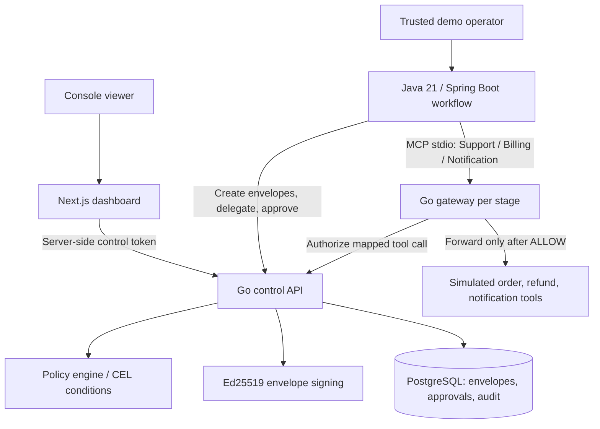
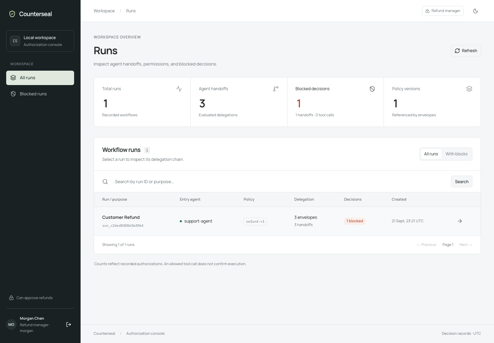
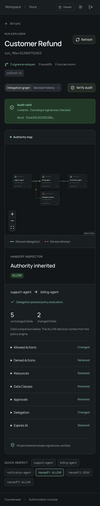

# Counterseal — project walkthrough

Counterseal checks whether an agent handoff preserves or narrows authority.
Signed envelopes carry permissions, resources, approval requirements, and expiry.
The Go policy engine rejects expanded authority, and an MCP gateway checks tool
calls before forwarding them. A Java/Spring Boot workflow demonstrates the flow;
a Next.js console makes the decisions inspectable.

## Architecture



The Java process is a trusted orchestrator. Each gateway fixes its agent identity
and envelope, maps tool arguments to resources, and asks the control API for an
authorization decision. The dashboard keeps its control token on the server.
The API persists audit decisions; Java saves workflow receipts and stages in durable
local checkpoints. [Crash recovery](workflow-recovery.md) skips completed tool calls
and stops uncertain outcomes for reconciliation. The system does not yet provide
independent operator identities or distributed workflow recovery.

## Screenshots and recording

These captures use synthetic order `48319` against a real local Go API and
disposable PostgreSQL database. The browser fixture creates a delegation chain
and an intentional authority-expansion denial directly through the API; it does
not invoke the Java workflow or a live model.






[Watch or download the automated browser walkthrough](assets/walkthrough.webm).
The silent recording includes login checks, search, an expanded-authority denial,
an allowed handoff, audit verification, dark mode, mobile layout, and logout.
Playback support depends on the browser; download the WebM if GitHub shows a file page.

## Two-minute narrated demo script

Start the stack before recording. Keep the launcher terminal, which prints local
credentials, out of the recording. Sign in before sharing your screen.

```bash
./compose.sh up
./compose.sh demo
```

Open http://localhost:3100. The commands below use simulated refunds only.

| Time | Show | Explain |
| --- | --- | --- |
| 0:00–0:20 | Runs overview | “An agent handing work to another agent must not silently give it more authority.” |
| 0:20–0:45 | Open the Java demo run and inspect handoffs | “Support delegates to Billing, then Notification. Signed envelopes carry the allowed actions and inherited constraints.” |
| 0:45–1:10 | Run `./compose.sh demo --amount=825`, refresh, inspect the new run's decision history | “This simulated refund exceeds the approval threshold. The gateway denies the call before forwarding it.” The command's nonzero exit is expected. |
| 1:10–1:35 | Run `./compose.sh demo --amount=825 --approve-demo-refund`, refresh, open the new run | “A trusted demo operator grants approval scoped to this refund. The same workflow can now proceed.” This creates a new run; it does not resume the denied run. |
| 1:35–1:50 | Click Verify audit | “The console verifies the stored audit chain, so the decision history can be inspected.” |
| 1:50–2:00 | Architecture diagram | “Java orchestrates, Go enforces, PostgreSQL stores decisions, and Next.js presents the evidence.” |

The approval flag simulates a trusted operator. This demo has no live LLM and
performs no real payment or email operations. Avoid describing it as a production
payment system or as preventing every form of prompt injection.

## Evidence and resume wording

- [Hosted CI](https://github.com/patelpratyush/Counterseal/actions/runs/35475480843): backend, Java/gateway, dashboard, policy Action, Docker, and aggregate gate passed.
- Java unit and integration tests cover success, denial, checkpoint integrity, and abrupt process-crash recovery.
- [Policy benchmark](benchmarks.md): median 0.150 ms per in-process comparison on the documented laptop and fixture.
- Protected `main` requires a passing CI gate and a pull request.

Suggested resume bullets:

> Built Counterseal, a Java 21/Spring Boot workflow orchestrator integrated with a Go MCP gateway, signed permission delegation, CEL approval policies, and PostgreSQL audit records.
>
> Implemented a Next.js/TypeScript delegation dashboard and automated validation with JUnit, Playwright, Docker Compose, and GitHub Actions, covering allowed and denied workflows.

## Refresh the captures

With the local development prerequisites from the root README installed:

```bash
npm ci --prefix dashboard
npm run build --prefix dashboard
(cd dashboard && npx playwright install chromium)
bash scripts/test-postgres.sh bash scripts/with-api.sh \
  npm run test:e2e --prefix dashboard -- --config playwright.portfolio.config.ts
```

Screenshots are written to `/tmp/handoffguard-{overview,run,mobile}.png`.
The recording is under `dashboard/test-results/portfolio/`, inside the test's
output directory. Review before replacing the files in `docs/assets/`; publish
only synthetic demo data. This uses TypeScript Playwright and Bash, with no Python.
