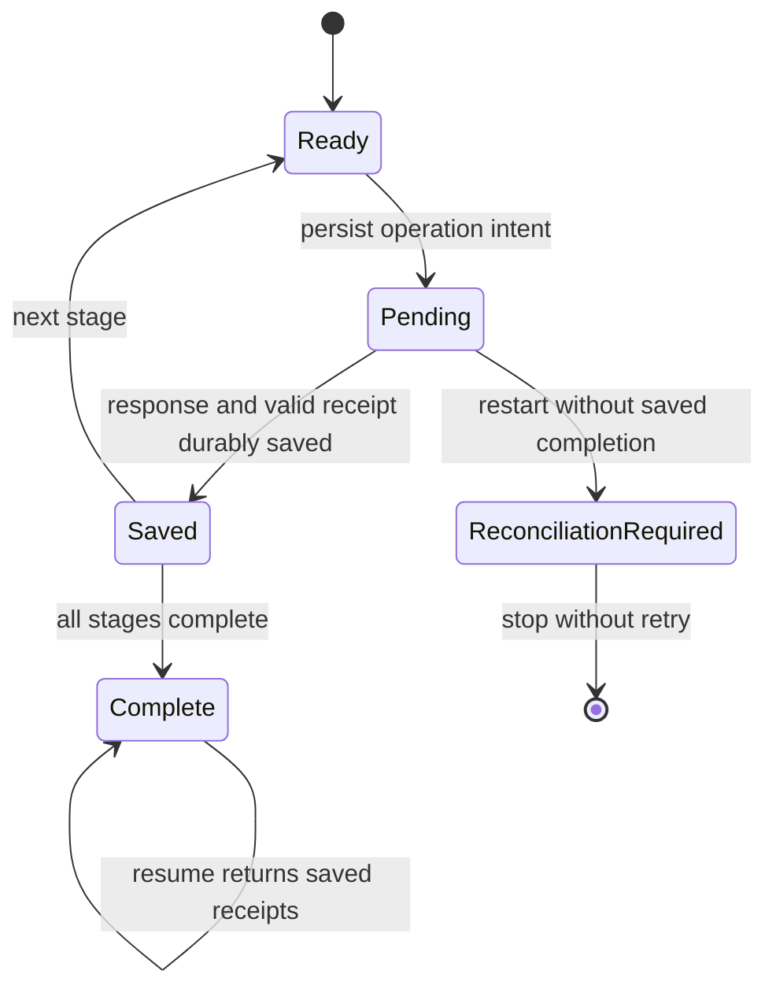

# Durable Java workflow recovery

The Java CLI saves each run in a separate checkpoint directory. After a process
crash, it can resume from saved receipts without reissuing completed tool calls.
An operation whose outcome is uncertain stops recovery with
`RECONCILIATION_REQUIRED` instead of retrying a possible refund.

## Start and resume

Use the same API, credentials, and Go binary setup as the
[Java guide](../integrations/java-workflow/README.md). For a new workflow:

```bash
java -jar integrations/java-workflow/target/handoffguard-workflow.jar \
  --state=.workflow-state/refund-demo --amount=825 --prepare-approval
```

Approve the prepared run in the console as a refund manager, then resume that exact workflow:

```bash
java -jar integrations/java-workflow/target/handoffguard-workflow.jar \
  --resume --state=.workflow-state/refund-demo
```

Resume loads the saved amount; request overrides are rejected. The public CLI
does not self-approve. Legacy checkpoints retain their original demo approval
choice, but that path only works with the explicitly enabled test compatibility API.
Already-created approvals are never automatically replaced.
The API still enforces expiry, revocation, and approval consumption.

Without `--state`, the CLI creates `.workflow-state/<UUID>` and prints the path
to stderr. `HANDOFFGUARD_WORKFLOW_STATE_DIR` changes the default parent directory.
An existing checkpoint requires `--resume`; a missing or corrupt checkpoint
never silently becomes a new run. A completed workflow can be resumed to verify
its audit and return its saved receipts without making any more tool calls.

For Docker, checkpoints live on a named volume:

```bash
./compose.sh demo --state=/data/workflows/refund-demo
./compose.sh demo --resume --state=/data/workflows/refund-demo
```

Use paths under `/data/workflows` in containers. Other container paths may be
read-only or disappear when the one-shot container exits. `compose.sh down`
preserves the volume; deleting volumes also deletes the checkpoints.

## Recovery decisions

| Durable state at interruption | Recovery behavior |
| --- | --- |
| Initial checkpoint, no run creation attempted | Creates the run |
| Delegated envelope saved, tool not attempted | Continues the stage using that envelope |
| Billing receipt saved | Skips Support and Billing; continues Notification with the original refund ID |
| All receipts saved | Verifies audit and returns the existing result |
| External operation started but completion not saved | Stops with `RECONCILIATION_REQUIRED`; sends no replacement operation |
| Different API origin, corrupt state, or inconsistent stage order | Refuses recovery |
| Another process owns the checkpoint | Refuses concurrent execution |

Root creation, delegation, approval creation, and tool execution all have intent
checkpoints. The marker is forced to disk before the external request. Completion
clears it only when the result and updated state can be saved together.
Even a definite denial retains the marker conservatively; this version does not
automatically retry denied calls or distinguish all upstream error outcomes.



## Storage and trust boundaries

Each directory contains `workflow.json` and a stable `workflow.lock`. The JSON
stores the API origin, original request, run ID, signed envelopes, stage attempts,
receipts, approval state, correlation events, and any pending operation. It stores
no API token or private signing key. Treat the directory as trusted operator data:
it is not an authenticated database and someone who can edit or roll it back can
invalidate duplicate-prevention guarantees.

An exclusive OS file lock is held for the lifetime of the workflow. Checkpoints
are written to a private temporary file, forced to disk, atomically renamed, and
the containing directory is synchronized. New directories are private to their
owner. Storage errors stop execution; there is no non-atomic fallback.
This relies on [Java file forcing and locking](https://docs.oracle.com/en/java/javase/21/docs/api/java.base/java/nio/channels/FileChannel.html)
and [atomic moves](https://docs.oracle.com/en/java/javase/21/docs/api/java.base/java/nio/file/StandardCopyOption.html).

Supported storage is a local POSIX filesystem on macOS/Linux, including the
Linux Docker volume. Network filesystems, multiple machines, concurrent access
through copied directories, disk loss, and checkpoint rollback are not supported.
Keep the original checkpoint and use it for every restart. Creating a new workflow
for the same order is a new operation and is not globally deduplicated.

## Uncertain outcomes

An audit ALLOW proves authorization, not that an upstream refund did or did not
execute. If the process dies after upstream success but before saving its receipt,
the checkpoint alone cannot establish the result. Do not clear the marker, delete
the directory, or start a replacement refund blindly. An operator must establish
the actual outcome with the upstream system first.

There is no automatic reconciliation command, compensation, or provider-level
idempotency protocol in this version. Adding a stable provider idempotency key and
an authoritative result lookup is the next step toward automatic recovery of
ambiguous outcomes. The shipped upstream is a simulation, not a payment service.

## Crash tests

```bash
bash scripts/test-postgres.sh bash scripts/smoke-agents.sh
```

Tests start a separate JVM against the real API, PostgreSQL, and MCP gateway.
The worker calls `Runtime.halt(17)` after a successful refund, once after saving
its receipt and once before saving it. A fresh process owner resumes the first
case with the exact refund ID and only one additional authorization (Notification).
The second case refuses recovery, preserves the pending marker, and creates no
additional authorization. The test worker is test-only and is not in the application JAR.

Additional checks cover reloading a completed run, a delegated-but-unattempted
stage, file locking, corrupt/missing state, changed API origins, immutable CLI
request parameters, owner-only checkpoint permissions, and failed checkpoint writes.
